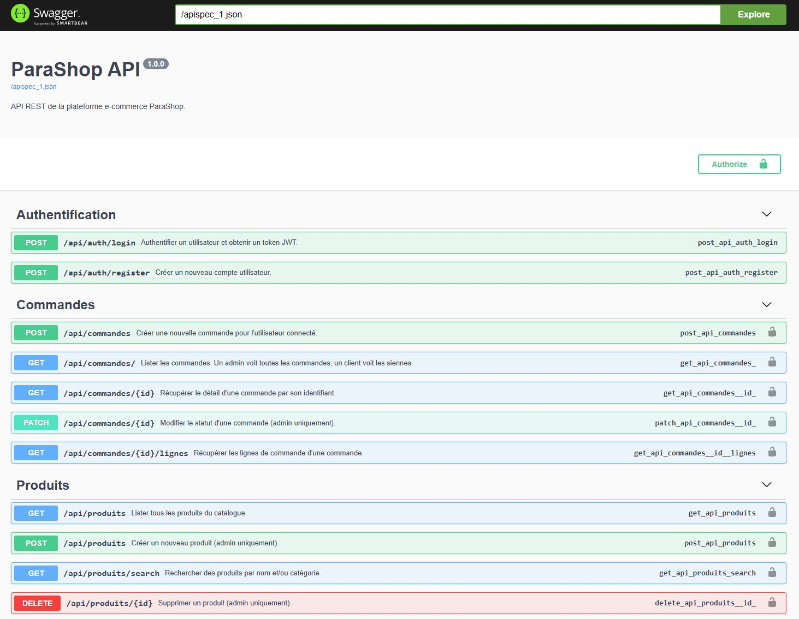
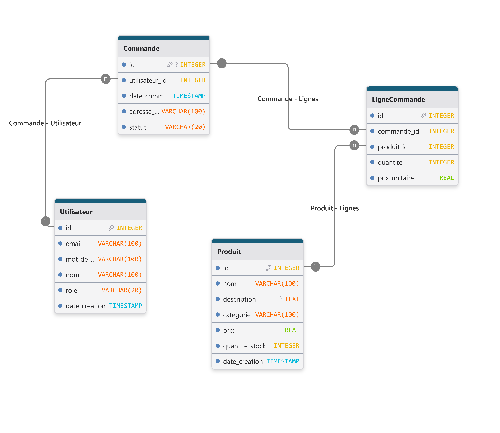

# API Project Blent

> *API REST Flask simulant le back-end d'une pharmacie en ligne (ParaShop) — projet du parcours Blent.*


<!-- Ajouter le badge CI dès le premier push GitHub :

-->

## Contexte

Projet pédagogique du parcours Blent : conception et développement d'une API REST en
Python/Flask pour le back-end d'une pharmacie en ligne fictive (**ParaShop**).
L'API expose trois domaines fonctionnels — authentification, catalogue produits et
commandes — avec une gestion fine des droits via JWT (utilisateur standard vs admin).

## Fonctionnalités

- Authentification par JWT (inscription, connexion, rôle admin via secret partagé)
- CRUD complet sur le catalogue produits (lecture pour tous, écriture réservée admin)
- Gestion des commandes avec décrémentation de stock et restauration lors d'une annulation
- Recherche produits par nom et catégorie
- Persistance SQLite via SQLAlchemy, script de seed inclus (`uv run python -m src.db_init`)
- Hashage sécurisé des mots de passe (Werkzeug)
- Documentation interactive Swagger (`/apidocs`)
- Suite de tests pytest avec rapport de couverture HTML

## Démarrage rapide

Prérequis : Python 3.11+, [uv](https://docs.astral.sh/uv/) installé.

```bash
# Cloner et entrer dans le projet
git clone https://github.com/arnaud-dg/API_Project_Blent.git
cd API_Project_Blent

# Installer les dépendances (prod + dev)
uv sync --all-extras

# Configurer les variables d'environnement
cp .env.example .env
# Éditer .env :
#   SECRET_JWT_TOKEN=<votre_secret_jwt>
#   ADMIN_SECRET_TOKEN=<votre_secret_admin>

# Initialiser la base de données avec les données de test
uv run python -m src.db_init

# Démarrer le serveur
uv run flask --app src.app run
```

L'API est alors disponible sur `http://localhost:5000`.
La documentation Swagger est accessible sur `http://localhost:5000/apidocs`.

## Documentation Swagger



## Endpoints

### Authentification — `/api/auth`

| Méthode | Route | Description | Auth |
|---------|-------|-------------|------|
| POST | `/api/auth/register` | Créer un compte | Non |
| POST | `/api/auth/login` | Se connecter, retourne un JWT | Non |

### Produits — `/api/produits`

| Méthode | Route | Description | Auth |
|---------|-------|-------------|------|
| GET | `/api/produits` | Liste tous les produits | JWT |
| GET | `/api/produits/<id>` | Détail d'un produit | JWT |
| GET | `/api/produits/search?nom=&categorie=` | Recherche par nom / catégorie | JWT |
| POST | `/api/produits` | Créer un produit | Admin |
| PUT | `/api/produits/<id>` | Modifier un produit | Admin |
| DELETE | `/api/produits/<id>` | Supprimer un produit | Admin |

### Commandes — `/api/commandes`

| Méthode | Route | Description | Auth |
|---------|-------|-------------|------|
| GET | `/api/commandes` | Liste les commandes (toutes si admin, les siennes sinon) | JWT |
| GET | `/api/commandes/<id>` | Détail d'une commande | JWT |
| POST | `/api/commandes` | Passer une commande | JWT |
| PATCH | `/api/commandes/<id>` | Modifier le statut d'une commande | Admin |
| GET | `/api/commandes/<id>/lignes` | Lignes d'une commande | JWT |

## Authentification

Passer le token JWT dans le header de chaque requête protégée :

```http
Authorization: <token>
```

Pour obtenir un accès admin lors de l'inscription, ajouter le champ `secret` avec
la valeur de `ADMIN_SECRET_TOKEN` dans le corps de la requête `/api/auth/register`.

## Codes de statut HTTP

| Code | Signification |
|------|---------------|
| 200 | Succès |
| 201 | Ressource créée |
| 400 | Requête invalide (champ manquant ou malformé) |
| 401 | Token absent ou invalide |
| 403 | Accès refusé (authentifié mais non autorisé) |
| 404 | Ressource introuvable |

## Schéma de base de données



## Stack technique

- **Langage** : Python 3.11
- **Framework** : Flask 3.1
- **ORM / base** : SQLAlchemy, Flask-SQLAlchemy, SQLite
- **Authentification** : PyJWT, Werkzeug (hashage)
- **Documentation** : Flasgger (Swagger / OpenAPI)
- **Gestion des dépendances** : uv + pyproject.toml
- **Qualité** : Ruff (lint + format), pytest + pytest-cov, mypy, pre-commit
- **CI/CD** : GitHub Actions (lint, tests, build Docker, déploiement VM)

## Structure du projet

```
.
├── src/
│   ├── app.py          # Point d'entrée Flask, enregistrement des blueprints
│   ├── models.py       # Modèles SQLAlchemy (Utilisateur, Produit, Commande, LigneCommande)
│   ├── utils.py        # Décorateurs JWT, sérialiseurs, validations
│   ├── db_init.py      # Script de seed (reset + données de test)
│   ├── routes/         # Blueprints : auth_routes, product_routes, order_routes
│   └── swagger/        # Fichiers de documentation Swagger par route
├── tests/              # Tests pytest (auth, produits, commandes, utils)
├── docs/               # Documentation (schéma SQL, captures)
├── .github/workflows/  # CI (lint + tests) et CD (build Docker + déploiement)
├── Dockerfile
└── pyproject.toml
```

## Tests

```bash
# Lancer la suite complète avec rapport de couverture
uv run pytest

# Le rapport HTML est généré dans htmlcov/index.html
```

## Auteur

**Arnaud Duigou** — [arnaud.duigou@data-boost.fr](mailto:arnaud.duigou@data-boost.fr)

## Licence

MIT — voir [LICENSE](./LICENSE).
