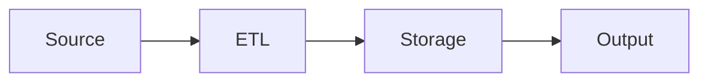

# API_Project_Blent

> Projet API du parcours Blent


<!-- Add a CI badge once you push to GitHub:

-->

<!-- Add a hero screenshot or GIF here for visual projects:

-->

## Why this project?

<!--
One paragraph explaining the problem this solves and for whom.
Concrete and specific. A non-technical reader should finish this paragraph
and know why they'd want to use the project.
-->

TODO: explain the business context in one paragraph.

## Features

<!-- TODO: list what the project does. Bullets, concrete. -->

- TODO
- TODO
- TODO

## Quick start

Requirements: Python 3.11+, [uv](https://docs.astral.sh/uv/) installed.

```bash
# Clone and enter
git clone <repo-url>
cd API_Project_Blent

# Install dependencies
make install-dev

# Copy and fill credentials
cp .env.example .env
# Edit .env with your values

# Run tests to verify setup
make test
```

## Project structure

```
.
├── config/         # Environment-specific settings
├── data/           # Raw and processed data (gitignored)
├── notebooks/      # Exploratory and reporting notebooks
├── sql/            # Versioned SQL queries
├── src/            # Reusable functions (cleaning, viz)
├── tests/          # Unit tests
├── outputs/        # Generated reports and figures (gitignored)
└── docs/           # Methodology and decision records
```

## Tech stack

- **Language**: Python 3.11
- **Package manager**: uv
- **Quality**: Ruff, pytest, mypy, pre-commit
- **CI/CD**: GitHub Actions

<!-- TODO: add the rest of your stack (pandas, DuckDB, Streamlit, etc.) -->

## Architecture

<!-- TODO: add a Mermaid diagram of the data flow if non-trivial:


-->

## Author

**Arnaud Duigou**

## License

MIT — see [LICENSE](./LICENSE).
